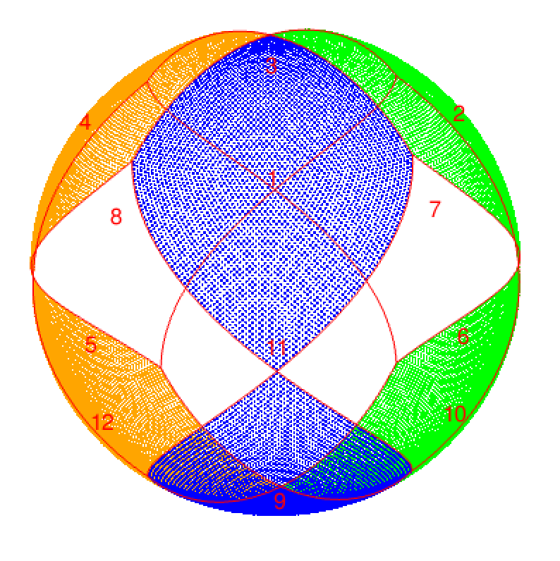
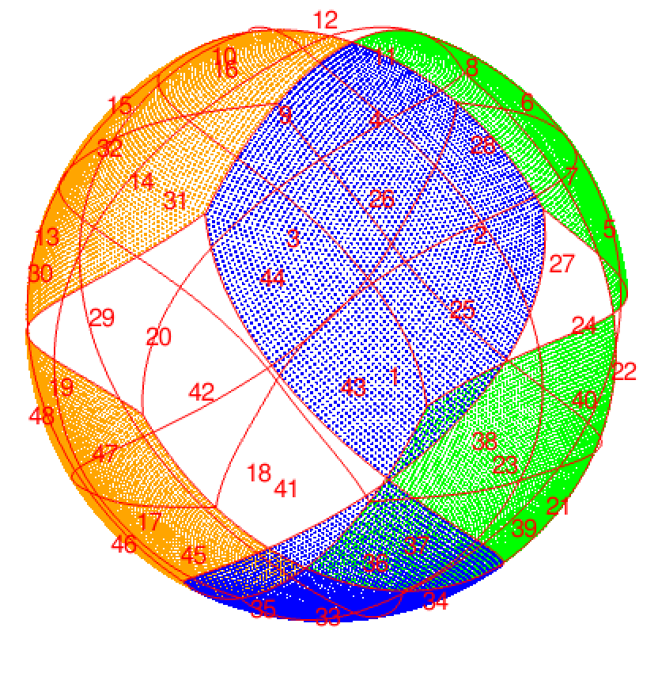
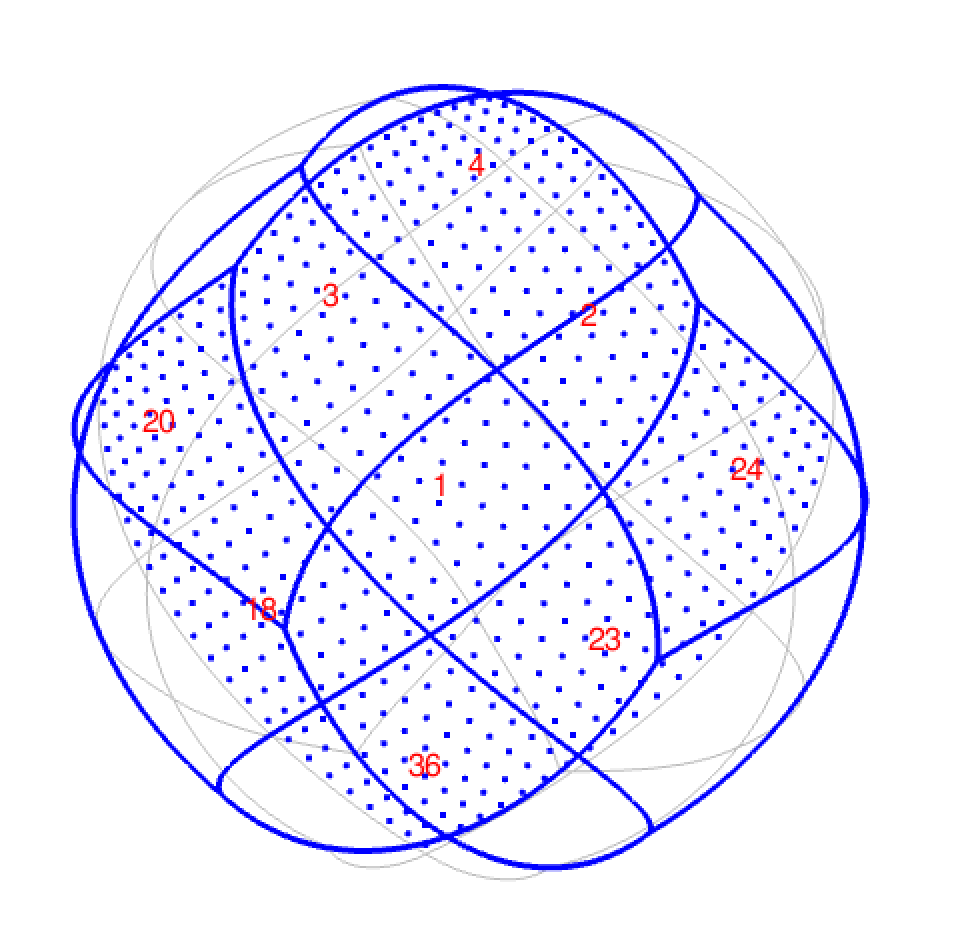
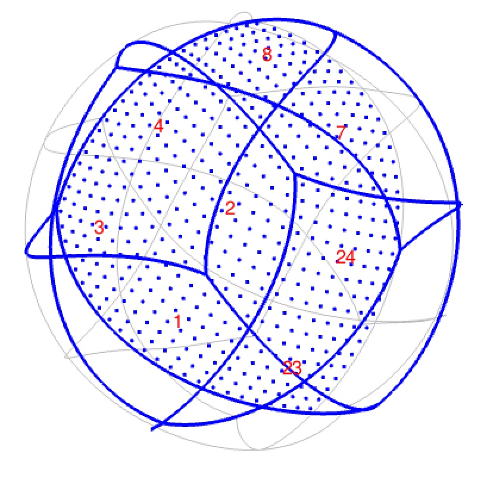

```{r setup, include=FALSE}
library(rcosmo)
library(INLA) 
require(FITSio)
library(data.table)
library(Matrix)
library(ggplot2)
list.of.packages <- c("gapminder", "gt", "tidyverse")

# install required packages, if necessary, and load them ----
{
  new.packages <- list.of.packages[!(list.of.packages %in% installed.packages()[,"Package"])]
  if(length(new.packages)) install.packages(new.packages)
  lapply(list.of.packages, require, character.only = TRUE)
}

knitr::opts_chunk$set(echo = TRUE)
```

## Healpix Daten Format
### Varriierende Anzahl an ersten Nachbarn als Artfeakt des Healpix-Format. \

In der niedrigsten Auflösung wird die Kugeloberfläche in 12 rautenförmige Basis Pixel unterteilt:
{#id .class width=300 height=300px}


Für Auflösung j = 1 werden die Rauten jeweils in 4 kleinere Rauten unterteilt und neu nummeriert:
{#id .class width=300 height=300px}
\

Daraus ergeben sich zwei mögliche Anzahlen an ersten Nachbarn: 7 oder 8.
Wobei die Anzahl der Pixel mit 7 Nachbarn konstant 24 ist für alle Auflösungen (Außer für Auflösung =  0).

Es gilt nside = $2^j$ und n_pixel = $12*nside^2$ 

Erste Nachabrn für Pixel 1 und Pixel 2 bei Auflösung 1:


{#id .class width=300 height=300px}
{#id .class width=300 height=300px}
\pagebreak

**Die Präzisionmatrix für Auflösung 1**
Die Präzisionsmatrix hat folgende Struktur.

```{r , echo=FALSE}
# Definiere Struktur der Nachbarschaftsmatrix W für Auflösung 'res'
res <- 1
n_side <- 2^(res)
pixel <- 12*n_side^2
neighbourhood <- list()
for(i in seq_len(12*(n_side)^2)){
  temp_neigh <- neighbours(i,res)
  neighbourhood[[i]] <- head(temp_neigh, -1)
}


vector <- rep(0,12*(n_side)^2)
temp_W <- replicate(12*(n_side)^2, vector, FALSE)

for(i in seq_len(12*(n_side)^2)){
  temp_W[[i]][neighbourhood[[i]]] <- 1
}

W <- as.matrix(as.data.table(temp_W)) # TODO: Die Präzisionsmatrix kann auch platzsparender  gespeichert werden wie in 'Bayesian Inference with INLA' beschrieben. Notwendig für höhere Auflösungen! 

# Um die Struktur visualiseren zu können wird Q ausgerechnet (geht aber nicht in die Berechnung # im inla Modell ein)
Q <- (diag((W%*%rep(1,pixel))[,1])-W) - Diagonal(pixel)
g = inla.read.graph(Q)
Q_inla = inla.graph2matrix(g)


image(Q_inla)

# Umordnung zur Bandmatrix
# g.file = inla.graph2matrix(g)
# inla.spy(g.file,  reordering = inla.qreordering(g,reordering = "band"))
```


Rang der Präzisionsmatrix: # TODO: Check ist Präzisionmatrix SPD?
```{r, echo = FALSE}
rankMatrix(Q)[1]
rankMatrix(Q_inla)[1]
```

## Parametriserung der Präzisionsmatrix -> Hyperparameter des hierarchischen Modells:
*Der räumliche Prozess soll als CAR-Prozess modelliert werden:* \
<H3>
$x_{\delta,s} =  \Sigma_{s' \in \partial(s)}w_{ss'}x_{\delta,s' } + \epsilon_s = - \frac{1}{q_{ss}}\Sigma_{s':s' \sim s}q_{ss'}x_{\delta,s'} + \epsilon_s$ \

$\epsilon_s \sim^{iid} N(0,\kappa_s^{-1})$ \

$w_{ss'} = - \frac{q_{ss'}}{q_{ss}}$ \

mit $x_{\delta} := GMRF$
\


*Die gemeinsame Dichte des GMRF ist implizit durch  die n full-conditionals spezifiziert.* \
\
$x_{\delta,s}|x_{\delta,-s} \sim N(\Sigma_{s':s' \neq s} w_{ss'}x_{\delta_,s'}, \kappa_s^{-1})$
für alle s = 1, ..., n
\


Die Präzisionsmatrix $Q = (q_{ss'})$ hat also folgende Elemente:

$q_{ss'} = \begin{cases} \kappa_s = \theta_1 & s= s'\\ -\kappa_s w_{ss'} = -\kappa_s -\frac{q_{ss'}}{q_ss} = q_{ss} \frac{q_{ss'}}{q_{ss}}  = \theta_{ss'} & s \neq s'
\end{cases}$


\
*(2m + 1) x (2m + 1) Fenster definiert Nachbarschaft:*

$\mathbb{E}(x_{\delta,s}|x_{\delta,-s}) =  -\frac{1}{\theta_{00}}\Sigma_{i'j'\neq 00} \theta_{i'j'}x_{\delta,ss'} = \frac{1}{\theta_{1}} \begin{bmatrix} \theta_2  \ \begin{matrix}
  \circ  \bullet \circ   \\    \bullet \circ \bullet   \\   \circ  \bullet \circ \end{matrix} \  +  \ \theta_3 \begin{matrix}  \bullet \circ \bullet   \\    \circ \circ \circ   \\   \bullet \circ \bullet\end{matrix} \end{bmatrix}$

$Prec(\delta_{m,ij}|\delta_{m,-ij}) = \theta_{oo}= \theta_1$
\

*Das GMRF ist durch 3 Parameter spezifiziert*.

$\theta_{1} \begin{bmatrix} && \frac{\theta_3}{\theta_1} \\ 1 & &\frac{\theta_2}{\theta_1} \end{bmatrix}$
\

**TODO**: Im Car Modell, das per generischer Funktion mit INLA modelliert werden alle
ersten Nachbarn (diagonale und gerade) mit dem selben Parameter ($\theta_2$) parametrisiert. 
Wie kann das zu der oben gezeigten Parametrisierung ($\theta_2$ und $\theta_3$) erweitert werden.? 

## Approximation der marginalen Posteriori der Parameter mittels INLA und rgeneric:
Das Modell ist wohl definiert für $\theta_1$, $\theta_2$ $\theta_3$ $\in$ ($\frac{1}{\lambda_{min}},\frac{1}{\lambda_{max}}$) mit $\lambda_i$ = Eigenwert von Nachbarschaftsmatrix $W$.
Skalierung um Autokorrelationsparameter < 1 zu halten: \

$\frac{W}{\lambda_max}$ \
</H3>

**Implementierung mit rgeneric folgt Kapitel 11.3 aus Bayesian Inference with INLA.** \
**TODO** Muss auf die Matter-Density-Karten von FLASK auch Gaussian Noise drauf gesampeld werden? Die Modellannahme für GMRF geht von Gaussian Noise aus.
```{r, echo = FALSE, warning = FALSE, message = FALSE}
# Folgende Simulation dient als Dummy, da Einlesen der Fits Datei noch nicht funktioniert!
# Simulation erfogt für Auflösung 1. Nachbarschaftsstruktur wird nicht! simuliert, ist also nur # eine sehr grobe Simulation!

nLags = 48 # number of lags (size of region)
# fake, uncorrelated observations
set.seed(1)
X = rlnorm(nLags)/10000
###############################################
# fake sigma... correlated decreases distance.
sigma = diag(nLags)
corr = 0.05
sigma <- corr ^ abs(row(sigma)-col(sigma))
###############################################
# Y is autocorrelated...
sky_sim <- t(X %*% chol(sigma))
set.seed(1)
sky_sim <- sky_sim + abs(rnorm(48,0,2)/10000)


# scale W matrix for being well defined: 
e.values <- eigen(W)$values
rho.min <- min(e.values)
rho.max <- max(e.values)
W <- W / rho.max

# this follows the implementation of a car modell in chapter 11.3 in Bayesian Infrence with 
# INLA.
interpret.theta <- function() {
  return(
    list(prec = exp(theta[1L]),
         rho = 1 / (1 + exp(-theta[2L])))
  )
}
graph <- function(){
  require(Matrix)
  
  return(Diagonal(nrow(W), x = 1) + W)
}


Q <- function() {
  require(Matrix)
  
  param <- interpret.theta()
  
  return(param$prec * (Diagonal(nrow(W), x = 1) - param$rho * W) ) # TODO: Erweiterung mit                                                                         #       theta_3
}


mu = function()
{
  return(numeric(0))
}


log.norm.const <- function() {
  param <- interpret.theta()
  n <- nrow(W)
  
  Q <- param$prec * (Diagonal(nrow(W), x = 1) - param$rho * W)
  
  res <- n * (-0.5 * log(2 * pi)) +
    0.5 * Matrix::determinant(Q, logarithm = TRUE)
  
  return(res)
}


log.prior <- function() {
  param = interpret.theta()
  
  res <- dgamma(param$prec, 1, 5e-05, log = TRUE) + log(param$prec) +
    log(1) + log(param$rho) + log(1 - param$rho)
  
  return(res)
}


initial <- function() {
  return(rep(0, 0))
}

quit <- function() {
  return(invisible())
}


'inla.rgeneric.CAR.model' <- function(
    cmd = c("graph", "Q", "mu", "initial", "log.norm.const",
            "log.prior", "quit"),
    theta = NULL) {
  
  #Internal function
  interpret.theta <- function() {
    return(
      list(prec = exp(theta[1L]),
           rho = 1 / (1 + exp(-theta[2L])))
    )
  }
  
  graph <- function(){
    require(Matrix)
    
    return(Diagonal(nrow(W), x = 1) + W)
  }
  
  Q <- function() {
    require(Matrix)
    
    param <- interpret.theta()
    
    return(param$prec * (Diagonal(nrow(W), x = 1) - param$rho * W) )
  }
  
  mu <- function()
  {
    return(numeric(0))
  }
  
  log.norm.const <- function() {
    return(numeric(0))
    
  }
  
  log.prior <- function() {
    param = interpret.theta()
    
    res <- dgamma(param$prec, 1, 5e-05, log = TRUE) + log(param$prec) +
      log(1) + log(param$rho) + log(1 - param$rho) 
    
    return(res)
  }
  
  initial <- function() {
    return(c(0, 0))
  }
  
  quit <- function() {
    return(invisible())
  }
  
  res <- do.call(match.arg(cmd), args = list())
  return(res)
}

CAR.model <- inla.rgeneric.define(inla.rgeneric.CAR.model, W = W)

# add index for latent effect
dt_sky <-as.data.table(cbind(seq_len(nrow(sky_sim)), sky_sim))
colnames(dt_sky) <- c("id_x", "obs")
df_sky <- as.data.frame(dt_sky)

# set car formular 
f.car <- obs ~ 1 + f(id_x, model = CAR.model)

# run inla
m.car <- inla(f.car, data = df_sky, family = "lognormal")
```

Das GRF (Materie-Dichte-Kontrast-Feld) ist durch das Healpix-Format schon diskretisiert. 

\
CAR.model <- inla.rgeneric.define(inla.rgeneric.CAR.model, W = W) \

f.car <- obs ~ 1 + f(id_x, model = CAR.model) \

m.car <- inla(f.car, data = df_sky, family = "gaussian") \

summary(m.car)
```{r, echo = FALSE, warnings = FALSE, message = FALSE}
summary(m.car)
```
\

**Darstellung con posterior marginals für Hyperparameter: Präzsionsparameter und rho.** 
**Umgewandelt in Modell Repräsenation:** 
**TODO:** Welche Repräsenation ist für uns relevant?
```{r, echo = FALSE}
marg.prec <- inla.tmarginal(exp, m.car$marginals.hyperpar[[1]])
marg.rho <- inla.tmarginal(function(x) { 1/(1 + exp(-x))},
                           m.car$marginals.hyperpar[[2]])

df_marg.prec <- as.data.frame(marg.prec)
df_marg.rho <- as.data.frame(marg.rho)


ggplot(df_marg.prec) + 
  geom_line(aes(x = x, y = y)) +
  ylab (expression(paste(pi, "(", tau, " | ", bold(y), ")")))

ggplot(df_marg.rho) + 
  geom_line(aes(x = x, y = y)) +
  ylab (expression(paste(pi, "(", rho, " | ", bold(y), ")")))

```
\

**Darstellung con posterior marginals für Hyperparameter: Präzsionsparameter und rho.** 
**In interner Repräsenation:**

```{r, echo = FALSE}
ggplot(as.data.frame(m.car$marginals.hyperpar[[1]])) + 
  geom_line(aes(x = x, y = y)) +
  ylab (expression(paste(pi, "(", tau, " | ", bold(y), ")")))

ggplot(as.data.frame(m.car$marginals.hyperpar[[2]])) + 
  geom_line(aes(x = x, y = y)) +
  ylab (expression(paste(pi, "(", rho, " | ", bold(y), ")")))
```

\

**Unterschiedliche Approximations und Integral Strategien können verglichen werden anhand von** **unterschiedlichen Metriken**

```{r, echo = FALSE}
# compare different fitting strategies
m.strategy <- lapply(c("gaussian", "simplified.laplace", "laplace"), 
                     function(st) {
                       return(lapply(c("ccd", "grid", "eb"), function(int.st) {
                         inla(f.car, data = df_sky,family = "lognormal",
                              control.inla = list(strategy = st, int.strategy = int.st),
                              control.compute = list(cpo = TRUE, dic = TRUE, waic = TRUE, config = TRUE))
                       }))
                     })

## get table with metrics for diferent fitting strategies

metrics_table <- data.frame(matrix(data = 0, ncol = 4))
colnames(metrics_table) <- c("model", "dic", "waic", "cpo")
names <- c("gaussian", "simplified.laplace", "laplace")
op <- c("ccd", "grid", "eb")
num <- 0
for(i in seq_len(length(c("gaussian", "simplified.laplace", "laplace")))){
  for(j in seq_len(length(c("ccd", "grid", "eb")))){
    num <- num + 1
    dic_temp <- m.strategy[[i]][[j]]$dic$dic
    waic_temp <- m.strategy[[i]][[j]]$waic$waic
    cpo_temp <- -sum(log(m.strategy[[i]][[j]]$cpo$cpo))
    metrics_table[num,1] <-paste0(names[i]," with ", op[j])
    metrics_table[num,2] <- dic_temp
    metrics_table[num,3] <- waic_temp
    metrics_table[num,4] <- cpo_temp
  }
}

# set constants for table
n = 0
c_col = c("#1e3048", "#274060", "#2f5375", "#4073a0", "#5088b9")
c_col_light_blue = c("#edf2fb", "#e2eafc", "#d7e3fc", "#ccdbfd", "#c1d3fe")
c_container_width = px(800)
c_table_width = px(650)
c_rn = 30
c_save = TRUE
c_format = "png"

# get table with metrics
metrics_table %>% gt()
```
\

**Darstellung der posteriori marginals der unterschiedlichen Strategien in Modell Repräsentation**

```{r, echo = FALSE}
num <- 0
post_marg.rho_list <- list()
post_marg.prec_list <- list()
colnames(metrics_table) <- c("model", "dic", "waic", "cpo")
names <- c("gaussian", "simplified.laplace", "laplace")
op <- c("ccd", "grid", "eb")
# compare marginal posteriors of hyperparameters
for(i in seq_len(length(c("gaussian", "simplified.laplace", "laplace")))){
  for(j in seq_len(length(c("ccd", "grid", "eb")))){
    num <- num + 1
    marg.prec_temp <- inla.tmarginal(exp, m.strategy[[i]][[j]]$marginals.hyperpar[[1]])
    marg.rho_temp <- inla.tmarginal(function(x) { 1/(1 + exp(-x))},
                                    m.strategy[[i]][[j]]$marginals.hyperpar[[2]])
    
    df_marg.rho_temp <- as.data.frame(marg.rho_temp)
    df_marg.prec_temp <- as.data.frame(marg.prec_temp)
    
    df_marg.rho_temp <- cbind(df_marg.rho_temp, fit.st = names[i], int.st = op[j])
    df_marg.prec_temp <- cbind(df_marg.prec_temp, fit.st = names[i], int.st = op[j])
    
    post_marg.rho_list[[num]] <- df_marg.rho_temp
    post_marg.prec_list[[num]] <- df_marg.prec_temp
  }
}

df_post_marg.rho <- rbindlist(post_marg.rho_list)
df_post_marg.prec <- rbindlist(post_marg.prec_list)


ggplot(data = df_post_marg.rho, aes(x = x, y = y)) + geom_line(aes(linetype=fit.st, color=int.st)) + ylab("marginal post") +
  xlab("rho")

ggplot(data = df_post_marg.prec, aes(x = x, y = y)) + geom_line(aes(linetype=fit.st, color=int.st)) + ylab("marginal post") +
  xlab("prec")
```

**sampling aus posterior marginals der Hyperparameter**


